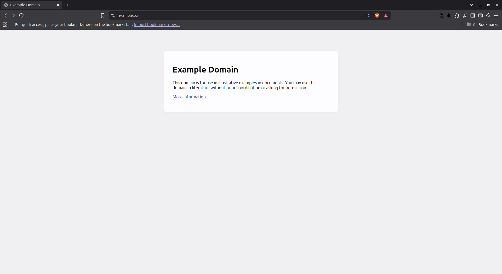
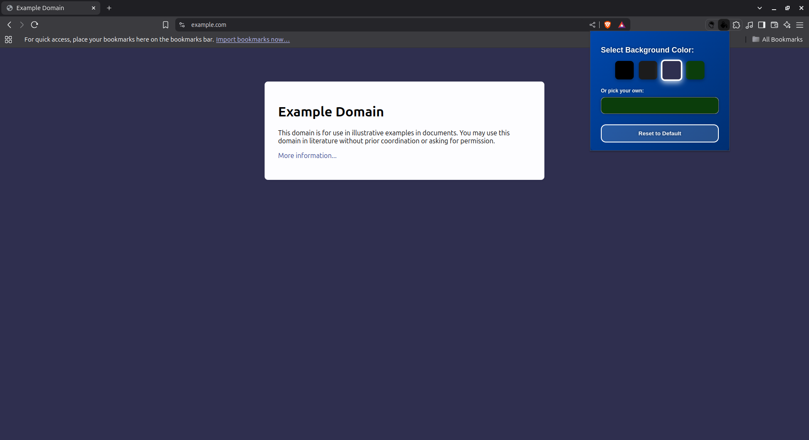
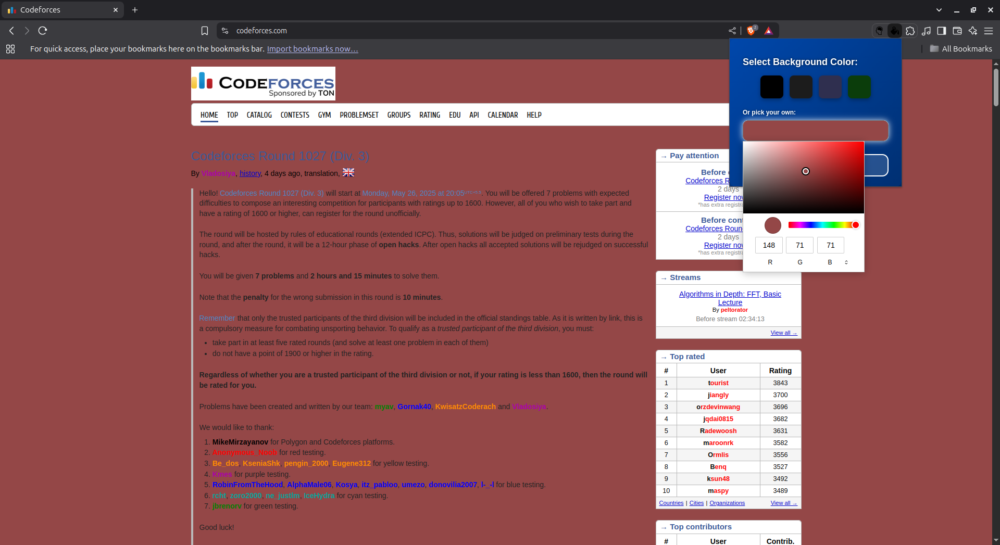

# Dark Mode Any Page

Hello, This is Vivek! Vivek doesn't like light mode themed pages. That's why I created this Chrome extension — to let you easily switch any website’s background to dark or custom colors you like, without changing the text color.

---

## Features

- Quickly toggle between several preset dark background colors  
- Pick your own custom background color from a color picker  
- Reset back to the website's original background color anytime  
- Applies instantly on the active tab without reload

---

## How to Use

1. Click the extension icon in the toolbar to open the popup.  
2. Choose a color from the dark palette or pick a custom color.  
3. The background color of the current website changes instantly!  
4. Click **Reset to Default** to revert the page’s background to the original color.

---

## Screenshots

1. **Original Website (Light Mode)**  
   

2. **After Applying Dark Mode Extension**  
   

3. **Custom Color Picker in Action**  
   

---

## Installation

- Clone or download this repository.  
- Open Chrome and go to `chrome://extensions/`  
- Enable **Developer Mode** (top-right toggle)  
- Click **Load unpacked** and select this project folder  
- The extension icon will appear in your toolbar — click it and enjoy!

---

## Permissions

This extension uses the `scripting` permission and host permissions for all URLs (`<all_urls>`) to inject styling scripts into web pages.

---

## Notes

- This extension only changes the background color of the page’s `<body>`. Some websites may have complex styles that override or affect visibility.  
- Text color remains unchanged to keep content readable.

---

## Feedback and Contributions

Feel free to open issues or submit pull requests! I’m happy to improve this project.

---

